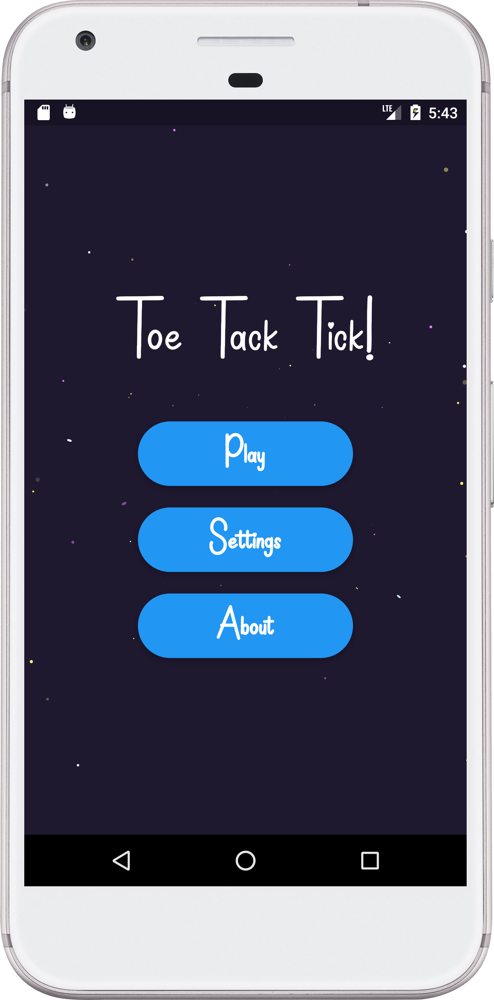
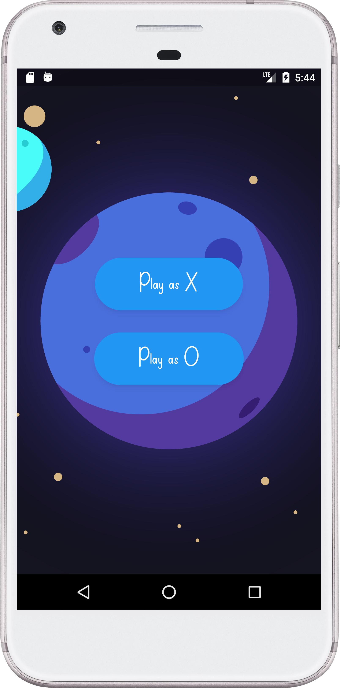
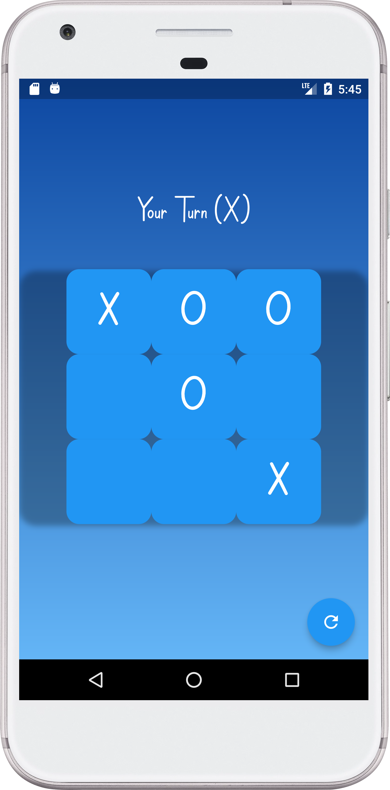

# Toe Tack TICK

A simple Tic Tac Toe game with an unbeatable AI opponent. Built using Flutter.

## Features

- Play against an unbeatable AI opponent.
- Beautiful and modern user interface.
- Enjoyable sound effect and music.
- Responsive design for various screen sizes.

## Screenshots

## Screenshots

## Getting Started

1. Clone this repository.
2. Make sure you have Flutter installed on your machine.
3. Navigate to the project directory and run `flutter pub get` to install dependencies.
4. Run the app using `flutter run`.

## How to Play

- Launch the app and choose your mark (X or O).
- Make your moves by tapping on the empty cells on the board.
- Try to form a line of your marks (horizontal, vertical, or diagonal) to win the game.

## Contributions
Contributions to this project are welcome! Feel free to open issues and submit pull requests.

